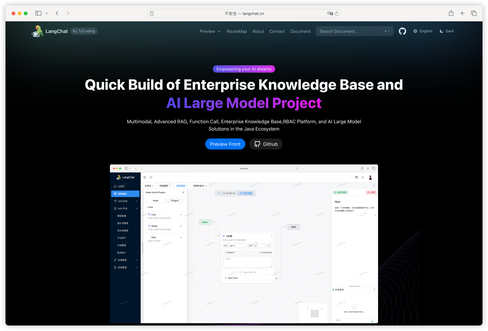
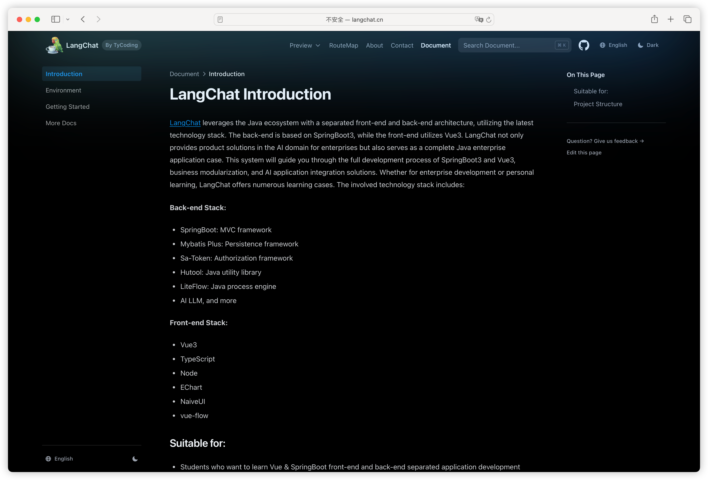
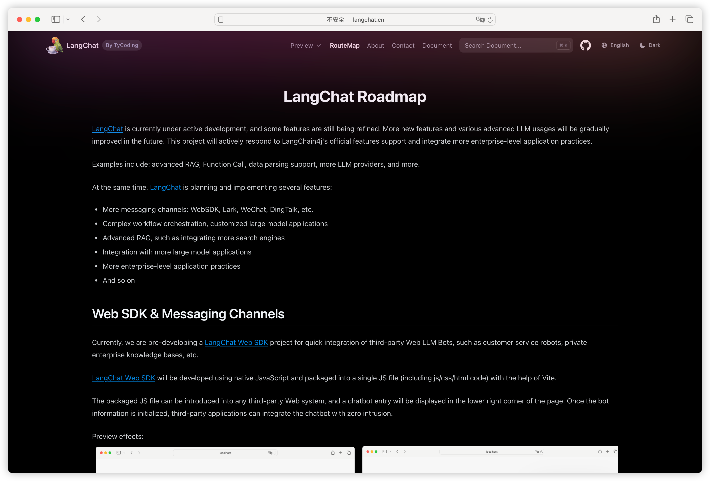

# LangChat.cn

LangChat开源项目: [https://github.com/tycoding/langchat](https://github.com/tycoding/langchat)

产品官网：[https://langchat.cn](https://langchat.cn)

本官网使用的技术栈:

- Nextra
- React
- Tailwind

LangChat产品开源不易，此官网不再提供免费源码，如果想要搭建这种官网的朋友，可以联系我获取源码。

可以提供技术支持，教你搭建同款炫酷的产品官网！！！

添加微信：LangChainChat（备注：LangChat官网）

## Preview

## 合作 & 赞助

进微信vip交流群，添加微信：LangChainChat（备注：赞助）

## License

This project is licensed under the MIT License.
